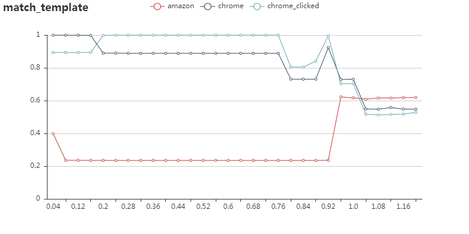

# stagesep2-sample

[stagesep2](https://github.com/williamfzc/stagesep2) 的使用示例

# 通过docker运行（推荐）

因为这一块的环境配置相对来说还是比较麻烦，可以直接使用官方镜像免除这些困扰。

## 下载 sample

```bash
git clone https://github.com/williamfzc/stagesep2-sample.git
cd stagesep2
```

## 运行

```bash
docker run --rm -v ${PWD}:/root/stagesep2 williamfzc/stagesep2 python sample.py
```

理论上，此时已经能够看到 stagesep2 开始运转，有日志开始打印出来。

# 通过常规方法（python包）运行

需要 python > 3.4

## linux

参考 [.travis.yml](https://github.com/williamfzc/stagesep2/blob/master/.travis.yml) 的配置安装即可。

## windows

### 安装 tesseract-ocr

- 官方已经提供了 [exe下载](https://github.com/UB-Mannheim/tesseract/wiki)。
- 在安装过程中记得勾选 chi_sim 语言包，否则无法分析中文。
- 安装后需要配置环境变量，应确保命令行运行 `tesseract` 是正常的。

### 安装 [tesserocr](https://github.com/sirfz/tesserocr)

官方推荐使用它们构建好的 wheel 文件进行安装。[传送门](https://github.com/sirfz/tesserocr#pip)

或者，按照正常方式安装（可能会有问题）：

- `pip install Cython`
- `pip install tesserocr`

如果在安装时报 `error: Microsoft Visual C++ 14.0 is required.` ，[点此安装即可](http://download.microsoft.com/download/6/A/A/6AA4EDFF-645B-48C5-81CC-ED5963AEAD48/vc_redist.x64.exe)。安装完成后重新安装 tesserocr。

## 安装本体

```bash
pip install stagesep2
```

## 运行

```bash
python sample.py
```

# 结果示例与处理

在分析结束后，全部的结果会以json的形式导出。比较推荐的做法是通过实际需要，自行编写脚本对json进行收集整理，最后转化成为自己需要的形式。

## 图表

stagesep2 也提供了简单的图表用于查看。



## json

以 dict/json 形式出现的原始数据。下面是数据示例：

```python
[
    {
        # 本次测试的id
        "result_id": "6778aee8-f7cc-11e8-988d-4a0001b8c310",

        # 视频名称
        "video_name": "./temp.avi",

        # 帧编号
        "frame_id": 1,

        # 帧对应的时间
        "current_time": 0.03333333333333333,

        # ocr分析结果
        # 该列表中出现的文字即该帧中检测出来的文字
        # 已用 jieba分词 进行进一步处理使结果更加合理
        "ocr": [
            "微信",
            "支付宝"
        ],

        # match template分析结果
        # 此处使用的算法是opencv自带的match_template
        # 此处提供了两个值是 cv2.minMaxLoc(res) 的最值
        # 默认算法是 cv2.TM_CCOEFF_NORMED
        # 可以通过 MatchTemplateConfig.cv_method = cv2.TM_SQDIFF_NORMED 修改算法
        # 参考 https://docs.opencv.org/master/d4/dc6/tutorial_py_template_matching.html
        "match_template": {
            "template1": {
                "min": -0.19261789321899414,
                "max": 0.1495080292224884
            }
        },

        # 趋势分析结果 分别是
        # 与前一帧的相似程度（0-1）
        # 与视频首尾帧的相似度（0-1）
        # 主要用于鉴定视频从何时进入稳态
        "trend": {
            "previous": 0.456235276681221
            "first": 1,
            "last": 0.9767144457213878
        }
    },

    ...
]
```
